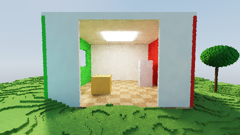
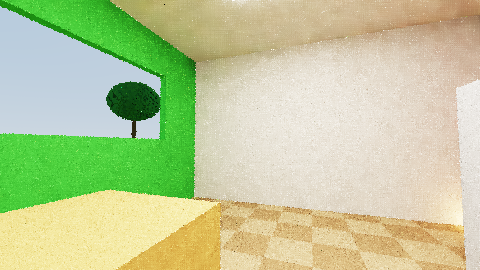

# VoxelRT

Real-time **path-traced global illumination** for a voxel world at **1/16 m
(6.25 cm) voxel scale**, rendered entirely with **GPU compute shaders** via
WebGPU. No rasterized geometry, no build step, no runtime dependencies —
every visible pixel is the result of a ray marched through a 256³ voxel grid.




*Above: converged captures from the headless WebGPU test rig. Note the
green/red bounce light on the white walls and the emissive ceiling panel — all
illumination is path traced; there are no precomputed lightmaps or ambient
terms.*

## Features

- **Sparse two-level DDA traversal** (WGSL compute): an Amanatides & Woo DDA
  walks 8³-voxel *bricks* first and only descends to per-voxel stepping inside
  occupied bricks, skipping empty space at 8× stride. 256³ voxels = a
  16 m × 16 m × 16 m world at 1/16 m scale.
- **Monte Carlo path tracing, 1 sample/pixel/frame**: cosine-weighted diffuse
  bounces (2 indirect bounces by default, up to 6), Russian roulette
  termination, firefly clamping.
- **Direct light via next-event estimation**: the sun is sampled as a cone
  (soft shadows) at every path vertex; the sun disc is excluded from
  secondary-ray sky hits so it is never double counted.
- **Emissive voxels**: any voxel can be an area light (the Cornell room's
  ceiling panel and the colored lanterns in the demo scene), picked up by path
  vertices for local GI.
- **Temporal reprojection accumulation**: each pixel's world position is
  reprojected into the previous frame using the previous view-projection
  matrix; history is validated against depth and normal and blended
  exponentially (up to 64 frames), so the image keeps converging while the
  camera moves.
- **Edge-aware à-trous wavelet denoiser** (SVGF-style, 3 iterations with
  steps 1/2/4): weights fall off across normal, depth and luminance edges, and
  the filter relaxes as temporal history accumulates.
- **Albedo demodulation**: the path tracer outputs illumination divided by
  primary-hit albedo, so the denoiser never smears voxel colors across faces;
  albedo is multiplied back at present time, followed by exposure and ACES
  tonemapping.

## Running

Any static file server works (WGSL files are fetched at runtime):

```sh
npx http-server -p 8080 -c-1 .     # or: python3 -m http.server 8080
```

Open `http://localhost:8080` in a WebGPU-capable browser (Chrome/Edge 113+,
or Firefox/Safari with WebGPU enabled).

### Controls

| Input            | Action                                  |
| ---------------- | --------------------------------------- |
| Click            | capture mouse (pointer lock)            |
| Mouse            | look                                    |
| `W A S D`        | move; `Space`/`E` up, `Q` down          |
| `Shift`          | move fast                               |
| `1`–`6`          | indirect bounce count                   |
| `F`              | toggle denoiser                         |
| `T`              | toggle temporal accumulation            |
| `L`              | animate the sun                         |
| `[` / `]`        | render scale down / up                  |

### URL parameters

`?grid=128` world size (voxels per axis, default 256) · `?scale=0.5` internal
render scale · `?bounces=3` indirect bounces · `?denoise=0` / `?temporal=0`
disable passes · `?px=&py=&pz=&yaw=&pitch=` camera pose ·
`?nocanvas=1` render offscreen only (headless testing).

## Frame pipeline

```
pathtrace.wgsl   compute 8×8   1 spp: primary ray + N GI bounces through the
                               voxel DDA, sun NEE at every vertex.
                               → demodulated radiance, albedo, G-buffer (normal+depth)
temporal.wgsl    compute 8×8   camera reprojection, depth/normal validation,
                               exponential accumulation (α = 1/history)
atrous.wgsl      compute 8×8   ×3 edge-aware wavelet iterations (steps 1,2,4)
present.wgsl     render        remodulate albedo, exposure, ACES, gamma
```

The voxel world lives in a storage buffer (one packed `u32` per voxel:
RGB albedo + emissive intensity) plus a brick-occupancy buffer
(one word per 8³ brick). Ping-ponged `rgba16float` textures carry
accumulation history; the G-buffer is `rgba32float` (normal + hit distance).

## Testing

A headless smoke test boots the renderer in Chromium with WebGPU, waits for
frames, reads the image back **from the GPU** (canvas presentation isn't
composited in headless mode) and fails on a blank image:

```sh
npm install
npm test                       # writes test/screenshot.png
npm run bench                  # short 1920x1080 HDR benchmark smoke
npm run bench:ablation         # 1920x1080 paper-style ablation harness
npm run bench:convergence      # convergence curves over fixed frame budgets
```

Benchmark runs write `test/eval/results.json`, `results.csv`, and
`summary.csv` with wall/GPU ms per frame, FPS, ms/megapixel, cumulative GPU
cost, pass percentages, adapter/runtime metadata, and repeat statistics.

On Windows, the test and benchmark harnesses launch Chromium with
high-performance GPU flags and fail if `nvidia-smi` reports an NVIDIA GPU but
WebGPU selects a non-NVIDIA adapter. Use `--allow-non-nvidia-gpu` or
`--allow-software-gpu` only for diagnostic runs that should not be trusted as
benchmark results.

## Notes on the demo scene

Procedurally generated at load: rolling grass terrain, a Cornell-style room
(white walls, red/green sides, emissive ceiling panel, two boxes) to show
color bleeding, trees, and three colored emissive lanterns. Scene generation
is ~150 ms for 16.7 M voxels; edit `src/scene.js` to build your own world —
anything that fills the `Uint32Array` works.
